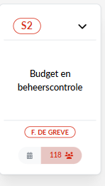

---

---
## Effectifs de S2 (selon intranet) au 01.05.2026

### 118 théoriques

> Ont disparu (pensionnés) : Danièle Brynart, Honoré Delpire, <u>Karel Pede</u> et Betty Vandevin  
> N'a encore pas disparu (mais pensionné) [1] : Dirk Machiels  
> Sont externes à S2 [8] : Jean-Baptiste Ary, Abdelhakim Atchakhou, Naomi Dubois, Mohamed El Otmani, Nathalie Janssens, Marc Nicolas, Moussa Oulad, Kadir Tastepe  
> Malades de longue durée [4] : Vincent Danckaert, Martine De Greef, Christophe Delmoitiez, Christiane Denis  
> Sont bientôt pensionnés : Werner D'Haeseleer, Fannu De Coninck  
> Rosetta : Maarten Lebacq

---

**PERMALINK:** [https://newdevprojects.github.io/S2/S25/Effectifs_S2_01-05-2026.html](https://newdevprojects.github.io/S2/S25/Effectifs_S2_01-05-2026.html)