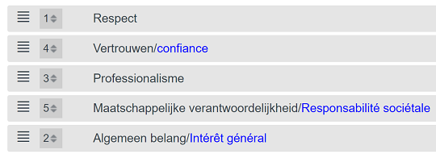

<link rel="stylesheet" href="https://newdevprojects.github.io/S2/S2.css">
<link rel="stylesheet" href="S2.css">

<u><b>NB:</b></u>  
Les PDF ont été transmis en pièces jointes avec la communication de l'ordre du jour.  
Les fichiers Excel se téléchargent en cliquant sur le lien.

| Permalink |
| :--- |
| [https://newdevprojects.github.io/S2/Staff_20200520/20200520_Staff_Agenda.html](https://newdevprojects.github.io/S2/Staff_20200520/20200520_Staff_Agenda.html) | 

# Staff 20200305 - Agenda

* (1) Opvolging vorige stafvergadering:
	* PV Stafvergadering [11.05.2020](20200511_Staff_PV.pdf) 
		* les remarques d'Edward du 11.05 sur le projet ont été intégrées
		* fonctions supérieures - toujours pas de suivi donné par S1 à la [note 000251 du 26.02.2020](Staff_20200520\Note_000251_Fonctions_superieures.pdf) 
* (2) DC 
	* Debriefing DC 12.05.2020 + [contact met de vakbonden](PV_reunion_syndicats_20200513.pdf)  (ontwerp Cl.Denis)
* (3) EWOW - stand van zaken
	* vergadering met Regie - [04.07.2019](20190704_Economie_vergadering_Regie.xlsx) 
	* berekening FOD - [input Jaarverlag S2](20200420_Mogelijke_scenario-s_input_jaarverslag_S2.xlsx) 
* (4) Quid date entrée en service de Julie Delvigne et Vanessa Folo ? - *Rosetta's* pour l'accueil
	* [15.06 ou 01.07 ?](Date_entree_service_Rosettas.pdf)   (approche recommandée par Robert)
* (5) HR-nieuws :
	* recrutements (en *stand-by*)
		* aucune sélection n'est organisée par Selor <del>avant le 18.05</del> avant le 25.05, et sous réserve que les [locaux](https://www.selor.be/nl/nieuws/2020/05/we-hernemen-onze-activiteiten-geleidelijk-aan/) soient rendus sûrs
		* aucun entretien ne peut de même être organisé (pour Selor) par S1
	* OK pour entrée en service au 01.06.2020 Vincent Zakowski (Niv. B - SPF Fin.) - *Talent Exchange* pour EMAS 
* (6) Varia
	* Voorstel extra communicatie - [ontwerp Peter]() 
	* Choix des valeurs fédérales - communiqué par le SPF BOSA au réseau RIEF le 14.05

	

	
