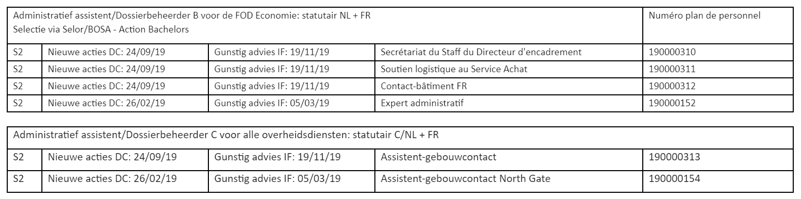

<link rel="stylesheet" href="https://newdevprojects.github.io/S2/S2.css">
<link rel="stylesheet" href="S2.css">

<u><b>NB:</b></u>  
Les PDF ont été transmis en pièces jointes avec la communication de l'ordre du jour.  

&nbsp;

&nbsp;

| Permalink |
| :--- |
| [https://newdevprojects.github.io/S2/Staff_20200618/20200618_Staff_Agenda.html](https://newdevprojects.github.io/S2/Staff_20200618/20200618_Staff_Agenda.html) | 

# Staff 20200618 - Agenda

* (1) Opvolging vorige stafvergadering:
	* PV Stafvergadering [04.06.2020](20200604_Staff_PV.pdf) 
* (2) DC 
	* Debriefing DC 09.06.2020 
	* Briefing DC 23.06.2020
* (3) Aanpassingen [tool vergoedingen](Aanpassingen_tool_vergoedingen.pdf) 
* (4) HR-nieuws (sinds 04.06) :
	* recrutements dont les sélections ont été relancées
		* Contrôleur subventions publiques : interview les 6 et 7 juillet (Edward + Robert) Atrium, 4/A12
			* 5 lauréats en mars
			* max. 4 candidats encore à interviewer
		* Analyste en comptabilité : les 8 et 9 juillet (Edward + Robert) Atrium, 4/B09
			* max. 6 candidats à interviewer
			* le cas a été fourni par Peter
	* accession de Vincent DANCKAERT au Niveau B - il a communiqué sa réussite au Screening Selor
	* exécution du plan de personnel (<u>les questions posées par Chloé au Staff S2 sont soulignées</u>)
		* A1 contrôleur subventions publiques NL ; la sélection Selor n'a fourni que deux lauréats (Peter & Mathias auraient dû avoir interview le 13.03)
			* question de Chloé : "*la sélection néerlandophone ne comporte plus de candidats, <u>est-ce que le remplacement du NL est possible par 1 extra FR ?</u>*" (vu les 5 lauréats FR après interviews de mars déjà obtenus)
		* A1/A2 Facility Manager assistant NL
			* info de Chloé : "*des tests sont à nouveau planifiés par Selor à partir de fin mai.*"
		* Liaison budgetaire BOSA <b>FR</b>
			* info de Chloé : "*avis favorable donné par IF le 23.07.2019 ; proposition d’un planning à Selor en cours ; <u>si accord donné par S2</u> sur la publication, le screening générique sera planifié dès la mi-juillet et en août*"
		* Gestion en full service support des SLA des entités liées au SPF <b>NL</b>
			* info de Chloé : "*avis favorable donné par IF le 19.11.2019 ; proposition d’un planning à Selor en cours ; <u>si accord donné par S2</u> sur la publication, le screening générique sera planifié dès la mi-juillet et en août*"
		* un Rosetta de Niveau C <b>NL</b>- Cf. [page 2 du point de situation](20200609_Rosetta_point_situation.pdf) 
			* suggestion de [Mathias](Rosetta_Reaction_Mathias.pdf) 
		* autres besoins ayant déjà reçu un OK de l'Inspecteur des Finances
			* voir <b>tableau</b> en dessous de l'agenda &dArr;&dArr;&dArr;
* (5) Varia
	* point de situation de la pyramide d'âge S2 (en vue de nourrir la réflexion/discussion sur les besoins futurs)
		*  [S22000 - Support Staff](S22000.pdf) + légende et [commentaires](S22000.md)
		*  [S24000 - Financiële Dienst](S24000.pdf) + légende et [commentaires](S24000.md)
		*  [S25000 - Aankoop Dienst](S25000.pdf) + légende et [commentaires](S25000.md)
		*  [S26000 - Facility Management](S26000.pdf) + légende et [commentaires](S26000.md)

---

&dArr;&dArr;&dArr;  
 

	
