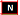

<link rel="stylesheet" href="https://newdevprojects.github.io/S2/S2.css">
<link rel="stylesheet" href="S2.css">

&nbsp;

| Permalink |
| :--- |
| [https://newdevprojects.github.io/S2/Staff_20210927/20210927_Staff_Agenda.html](https://newdevprojects.github.io/S2/Staff_20210927/20210927_Staff_Agenda.html) | 

# Staff 20210927 - Agenda

* (1) Opvolging vorige stafvergaderingen
	* [PV Staff 10.09.2021](https://newdevprojects.github.io/S2/Staff_20210910/20210910_Staff_PV.html)
	* [To Do's](#todo) en terugkerende dossiers
* (2) DC 
	* Debriefing DC 15.09.2021
		* FR : [ADM](https://newdevprojects.github.io/S2/Staff/20210915_Adm_FR.pdf) - [THEM](https://newdevprojects.github.io/S2/Staff/20210915_Them_FR.pdf)
		* NL : [ADM](https://newdevprojects.github.io/S2/Staff/20210915_Adm_NL.pdf) - [THEM](https://newdevprojects.github.io/S2/Staff/20210915_Them_NL.pdf)
	* Briefing DC 28.09.2021
* (3) Nouveau contrat d'administration
	* Fichier à compléter - [fourni par Edward le 01.09](20210901_Contrat_adm_Doc_GroupeMoors.xlsx) 
	* [Version lisible](https://collectednotes.com/bobjr1/table-lisible) de ce tableau
* (4) Perspectives RH
	* Exécution du plan de personnel
		* [Table](TablePlansPersonnel_20210908.pdf)  (état au 08.09.2021)
		* Les actions qui ont connu des changements sont marquées 
* (5) Varia
	* x
	

## ToDo Items

| Point | Qui ? | Quand ? | Suivi |
| --- | :---: | --- | --- | --- |
| EWOW | Mathias | récurrent | &Eacute;tat des lieux |
| RGPD | Yassine | récurrent | &Eacute;tat des lieux |
| Kritische processen | Peter | récurrent | &Eacute;tat des lieux |
| Gestion des archives | Mathias | récurrent | &Eacute;tat des lieux |

## &#10103; Tâches davantage ponctuelles

| Point | Qui ? | Quand ? | Suivi |
| --- | :---: | --- | --- | --- |
| Restaurant | Mathias | 1° trim. 2021 | opvolging [voorstel](https://newdevprojects.github.io/S2/Staff_20210107/20210107_Sodexo_aangepaste_werking.pdf) dienstverlening Sodexo |
| Contrats nettoyage | Mathias | &nbsp; | adaptation des contrats de nettoyage (moins de prestations, désinfection) |
| Intégration du Mailroom E8 | Mathias | &nbsp; | voir [projet](https://newdevprojects.github.io/S2/Staff_20210204/Nota_verzendingsdienst_E8.pdf) contact nécessaire avec DG ai. E8 |

## &#10104; ToDo à plus long terme

| Point | Qui ? | Quand ? | Suivi |
| --- | :---: | --- | --- | --- |
| SLA ABC | RMass | 3° trim. 2021 | Renégociation SLA 2013 |
